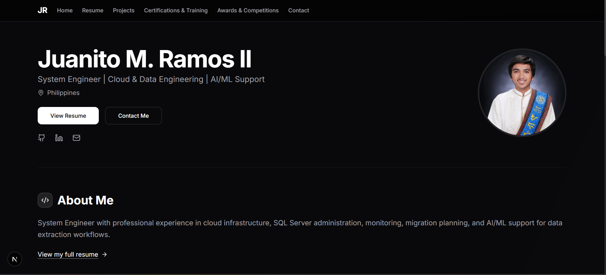
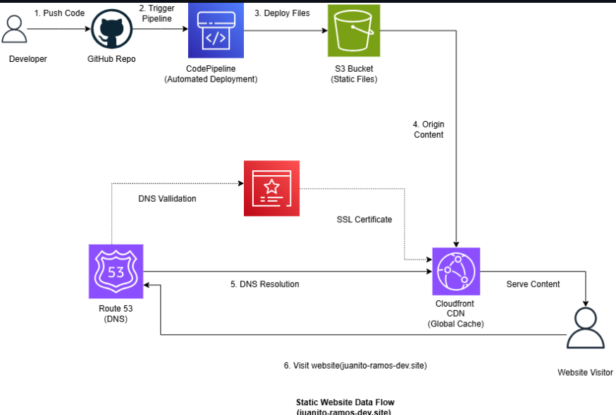
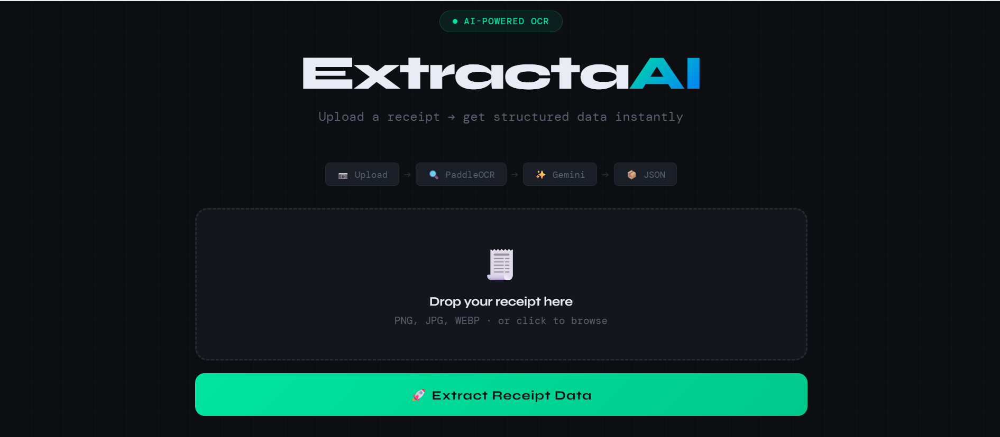
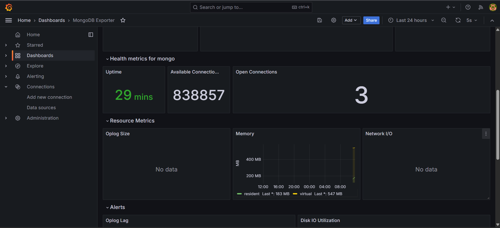

<div align="center">

# Juanito Portfolio Website

**Professional portfolio for cloud/devops engineering, AI engineering, backend development, and software engineering (Python focused) project work**

  

---


</div>

---

## Table of Contents

1. [Overview](#overview)
2. [Tech Stack](#tech-stack)
3. [Portfolio Flow](#portfolio-flow)
4. [Repository Structure](#repository-structure)
5. [Core Features](#core-features)
6. [Portfolio Content](#portfolio-content)
7. [Screenshots](#screenshots)
8. [Getting Started](#getting-started)
9. [Environment Variables](#environment-variables)
10. [Available Scripts](#available-scripts)
11. [API Reference](#api-reference)
12. [Content Editing Guide](#content-editing-guide)
13. [Deployment Notes](#deployment-notes)
14. [Future Improvements](#future-improvements)
15. [Connect With Me](#connect-with-me)

---

## Overview

Juanito Portfolio Website is a modern personal portfolio built with Next.js, TypeScript, Tailwind CSS, and reusable shadcn/Radix UI components. It presents professional experience, cloud and DevOps work, AI and machine learning projects, hackathon achievements, certifications, technical blog posts, and contact information in one deployable web application.

  

The application is structured around typed portfolio data files and App Router pages:

- **Next.js App Router** powers the portfolio pages, metadata, routing, and API route.
- **TypeScript data modules** store resume, project, contest, and certification content.
- **Markdown blog posts** are parsed with `gray-matter`, `remark`, and `remark-html`.
- **Tailwind CSS and shadcn/Radix UI** provide the visual system and component primitives.
- **Vercel** hosts the production portfolio and runs the Next.js build.

**Primary capabilities:**

- Display a server-rendered professional hero section with profile, role, location, and social links
- Show professional summary, work experience, skills, languages, and contact details
- Serve a resume PDF through a Next.js API route
- Render projects grouped by Cloud/DevOps and Software/AI categories
- Highlight featured projects on the home page
- Render certifications and training entries with key learnings
- Render awards, competitions, and hackathon entries
- Render Markdown-powered blog posts
- Support dark mode through `next-themes`
- Use Vercel Analytics for production traffic insights
- Skip Vercel deployments for README-only pushes through `vercel.json`

---

## Tech Stack

### Web Application

| Layer                | Technology           | Version            | Purpose                                                                       |
| :------------------- | :------------------- | :----------------- | :---------------------------------------------------------------------------- |
| Framework            | Next.js              | 15.5.x             | App Router pages, metadata, API route, production build                       |
| UI Runtime           | React                | 18.x               | Component-driven interface                                                    |
| Language             | TypeScript           | 5.x                | Typed data, components, route logic, and project safety                       |
| Styling              | Tailwind CSS         | 3.4.x              | Utility-first responsive styling                                              |
| Component Primitives | Radix UI / shadcn UI | Latest package set | Accessible dialogs, cards, buttons, menus, tabs, forms, and layout primitives |
| Icons                | Lucide React         | 0.454.x            | Interface and social icons                                                    |
| Animation            | Framer Motion        | Latest             | Client-side hero animation support                                            |
| Theme                | next-themes          | Latest             | Dark mode and theme provider                                                  |

### Content and Data

| Layer            | Technology                             | Purpose                                                      |
| :--------------- | :------------------------------------- | :----------------------------------------------------------- |
| Portfolio Data   | TypeScript modules in `data/`          | Resume, projects, contests, certifications, featured entries |
| Blog Content     | Markdown files in `posts/`             | Technical article source content                             |
| Markdown Parsing | `gray-matter`, `remark`, `remark-html` | Frontmatter extraction and HTML generation                   |
| Static Assets    | `public/images/`                       | Profile image, project thumbnails, contest images, icons     |
| Resume File      | `public/giovani-resume.pdf`            | PDF served by `/api/resume-pdf`                              |

### Deployment

| Layer              | Platform or Tool    | Purpose                                           |
| :----------------- | :------------------ | :------------------------------------------------ |
| Hosting            | Vercel              | Production deployment for the Next.js portfolio   |
| Analytics          | `@vercel/analytics` | Production visitor analytics                      |
| Build Config       | `next.config.mjs`   | Next.js build behavior and image configuration    |
| Deploy Skip Config | `vercel.json`       | Skips Vercel builds when only `README.md` changes |

---

## Portfolio Flow

```txt
Visitor
  |
  v
Vercel Hosted Next.js App
  |
  |-- App Router pages
  |   |-- /
  |   |-- /resume
  |   |-- /projects
  |   |-- /certifications
  |   |-- /contests
  |   |-- /blog
  |   |-- /contact
  |
  |-- Typed content modules
  |   |-- data/resume-data.ts
  |   |-- data/projects-data.ts
  |   |-- data/contests-data.ts
  |   |-- data/certifications-data.ts
  |
  |-- Markdown blog parser
  |   |-- posts/*.md
  |   |-- lib/posts.ts
  |
  |-- Static image and icon assets
  |   |-- public/images/*
  |
  `-- API route
      `-- GET /api/resume-pdf
```

### Deployment Flow

```txt
GitHub Repository
  |
  v
Push to connected branch
  |
  v
Vercel Git Integration
  |
  |-- Runs ignoreCommand from vercel.json
  |   `-- README-only change: skip build
  |
  `-- App/source change: run Next.js build
       |
       v
Production Portfolio Deployment
```

---

## Repository Structure

```txt
juanito-portfolio-website/
|-- app/
|   |-- api/
|   |   `-- resume-pdf/
|   |       `-- route.ts              # Serves the resume PDF
|   |-- blog/
|   |   |-- [slug]/
|   |   |   |-- BlogPostPageClient.tsx
|   |   |   `-- page.tsx              # Dynamic blog post route
|   |   `-- page.tsx                  # Blog listing page
|   |-- certifications/
|   |   `-- page.tsx                  # Certifications and training page
|   |-- contests/
|   |   `-- page.tsx                  # Awards and competitions page
|   |-- contact/
|   |   `-- page.tsx                  # Contact links and details
|   |-- projects/
|   |   `-- page.tsx                  # Project gallery grouped by category
|   |-- resume/
|   |   |-- loading.tsx
|   |   `-- page.tsx                  # Resume page
|   |-- layout.tsx                    # Root metadata and layout wiring
|   |-- page.tsx                      # Home page
|   `-- globals.css
|
|-- components/
|   |-- ui/                           # shadcn/Radix UI components
|   |-- featured-projects.tsx
|   |-- featured-contests.tsx
|   |-- featured-certifications.tsx
|   |-- header.tsx
|   |-- footer.tsx
|   |-- server-hero-section.tsx
|   |-- resume-download-button.tsx
|   `-- theme-provider.tsx
|
|-- data/
|   |-- resume-data.ts                # Profile, experience, skills, links
|   |-- projects-data.ts              # Project records and featured projects
|   |-- contests-data.ts              # Competition and hackathon records
|   |-- certifications-data.ts        # Training and certification records
|   `-- blog-data.ts                  # Blog helper exports
|
|-- lib/
|   |-- posts.ts                      # Markdown blog parser
|   `-- utils.ts
|
|-- posts/
|   |-- graphql-vs-rest-python.md
|   |-- optimizing-fastapi-performance.md
|   `-- scalable-python-microservices.md
|
|-- public/
|   |-- images/                       # Profile, project, and contest images
|   |-- favicon.ico
|   |-- favicon-16x16.png
|   |-- favicon-32x32.png
|   |-- apple-touch-icon.png
|   `-- giovani-resume.pdf            # Expected resume PDF file
|
|-- styles/
|   `-- globals.css
|
|-- next.config.mjs                   # Next.js build and image config
|-- tailwind.config.ts                # Tailwind theme and plugins
|-- tsconfig.json                     # TypeScript config and path aliases
|-- vercel.json                       # Vercel ignored build command
|-- package.json                      # Dependencies and scripts
`-- README.md
```

---

## Core Features

### Professional Landing Page

- Server-rendered hero section using `ServerHeroSection`
- Profile image from `public/images/profile.png`
- Name, role, location, resume CTA, contact CTA, and social links from `data/resume-data.ts`
- Featured projects, certifications, and competition entries on the home page

### Resume Page and PDF Access

- Resume content is stored in `data/resume-data.ts`
- Work experience, skills, languages, and professional links are rendered from typed data
- `ResumeDownloadButton` opens the PDF endpoint
- `GET /api/resume-pdf` serves `public/giovani-resume.pdf`

### Project Gallery

- Projects are stored in `data/projects-data.ts`
- Projects are grouped into:
  - Cloud/DevOps Engineering Projects
  - Full-Stack Development, Embedded Systems, AI & Machine Learning Projects
  - AI Automation projects placeholder section
- Each project card supports image, description, tags, live demo link, and GitHub link

### Certifications and Training

- Certification entries are stored in `data/certifications-data.ts`
- Each card supports issuer, year, description, tags, credential link, project link, and key learnings
- Placeholder visuals are used when no certificate image is provided

### Awards and Competitions

- Contest entries are stored in `data/contests-data.ts`
- Includes hackathons, startup challenges, awards, organizer, year, tags, and optional repo/demo links
- Featured contest logic prioritizes awarded entries

### Markdown Blog

- Blog posts live in `posts/*.md`
- Frontmatter stores title, date, excerpt, read time, tags, and optional image
- `lib/posts.ts` reads Markdown with `gray-matter` and transforms content with `remark-html`

### UI and Theming

- Tailwind CSS design tokens are configured in `tailwind.config.ts`
- Radix UI and shadcn-style components power cards, buttons, forms, dialogs, drawers, tabs, menus, and more
- `next-themes` supports theme switching
- Lucide React provides consistent iconography

---

## Portfolio Content

### Featured Projects

| Project                                  | Category    | Focus                                                      |
| :--------------------------------------- | :---------- | :--------------------------------------------------------- |
| Automated AWS Web Hosting with Terraform | Cloud       | AWS, Terraform, S3, CloudFront, Route 53, ACM              |
| Containerized Monitoring System          | Cloud       | Docker Compose, Prometheus, Grafana, MongoDB observability |
| ExtractAI                                | Software/AI | PaddleOCR, Gemini API, structured receipt extraction       |

### Additional Project Areas

| Area                    | Examples                                                         |
| :---------------------- | :--------------------------------------------------------------- |
| Cloud and DevOps        | AWS architecture design, Terraform hosting, monitoring stack     |
| AI and Machine Learning | OCR pipelines, classification, regression, forecasting, EDA      |
| Embedded and IoT        | SortiPhy, FingerFlux, SmartTrafficLight System                   |
| Full-Stack and Frontend | PresyoCheck, IP Address Tracker, Random Quote Machine            |
| Data and Analytics      | Power BI dashboard, Spotify EDA, agriculture predictive modeling |

### Awards and Competitions

| Event                                | Organizer                           | Year | Result        |
| :----------------------------------- | :---------------------------------- | :--- | :------------ |
| STARTer Hackathon                    | National Technovation Summit / DOST | 2025 | Champion Team |
| Space Business Innovation Challenge  | Philippine Space Agency             | 2025 | Runner-Up     |
| Breaking Enigma 2025                 | Philippine Startup Week             | 2025 | Finalist      |
| Zero to Agent: Manila Hackathon 2026 | Vercel                              | 2026 | Participant   |

### Certifications and Training

| Certification or Training           | Issuer            | Year | Focus                                             |
| :---------------------------------- | :---------------- | :--- | :------------------------------------------------ |
| AWS Cloud Practitioner Essentials   | AWS Skill Builder | 2026 | AWS fundamentals, security, billing               |
| AWS Academy Cloud Architecting      | AWS Academy       | 2026 | VPC design, high availability, cloud architecture |
| n8n AI Automation Workflow Training | Independent Study | 2026 | AI automation, API workflows, orchestration       |

---

## Screenshots

<div align="center">
  <table border="0" cellpadding="12" cellspacing="0" style="border-collapse: collapse; width: 100%; table-layout: fixed;">
    <tr>
      <td align="center" width="50%">
        <strong>1. Profile Asset</strong><br>
        <br>
        <sub>Main profile image used in the hero and resume sections.</sub>
      </td>
      <td align="center" width="50%">
        <strong>2. Featured Cloud Project</strong><br>
        <br>
        <sub>Terraform and AWS static web hosting project highlighted in the portfolio.</sub>
      </td>
    </tr>
    <tr>
      <td align="center" width="50%">
        <strong>3. Featured AI Project</strong><br>
        <br>
        <sub>AI-powered receipt understanding project using OCR and Gemini API.</sub>
      </td>
      <td align="center" width="50%">
        <strong>4. Featured Monitoring Project</strong><br>
        <br>
        <sub>Docker, Prometheus, Grafana, and MongoDB observability project.</sub>
      </td>
    </tr>
  </table>
</div>

> Replace or extend this section with full-page screenshots if you capture the live home, projects, resume, and contact pages.

---

## Getting Started

### Prerequisites

- Node.js 18 or later
- npm
- Git

### Installation

```bash
# Clone the repository
git clone https://github.com/Juaaanits/juanito-portfolio-website.git
cd juanito-portfolio-website

# Install dependencies
npm install
```

### Run Locally

```bash
npm run dev
```

Open:

```txt
http://localhost:3000
```

### Build Locally

```bash
npm run build
```

### Start Production Build

```bash
npm run start
```

---

## Environment Variables

This project currently does not require environment variables.

If external services are added later, create a local `.env.local` file:

```dotenv
# Example only
NEXT_PUBLIC_ANALYTICS_ID=
CONTACT_FORM_ENDPOINT=
```

Never commit real secrets or production credentials.

---

## Available Scripts

| Command         | Description                                |
| :-------------- | :----------------------------------------- |
| `npm run dev`   | Start the Next.js development server       |
| `npm run build` | Build the production application           |
| `npm run start` | Start the production server after building |
| `npm run lint`  | Run the configured Next.js lint command    |

---

## API Reference

### `GET /api/resume-pdf`

Serves the resume PDF from the local public folder.

**Expected file path:**

```txt
public/juanito-ramos-resume.pdf
```

**Response:**

```txt
Content-Type: application/pdf
Content-Disposition: inline; filename="juanito-ramos-resume.pdf"
```

If the PDF is missing, the route returns:

```json
{
  "error": "Failed to serve PDF"
}
```

---

## Content Editing Guide

### Update Resume Content

Edit:

```txt
data/resume-data.ts
```

This controls:

- Name, title, email, location, links, and profile photo
- Professional summary
- Skills and skill categories
- Work experience
- Languages
- Publications data used by the resume page

### Add or Edit Projects

Edit:

```txt
data/projects-data.ts
```

Each project supports:

- `title`
- `description`
- `image`
- `category`
- `tags`
- `github`
- `demo`

Project images should be placed in:

```txt
public/images/
```

### Add Blog Posts

Create a Markdown file in:

```txt
posts/
```

Use this frontmatter shape:

```md
---
title: "Article Title"
date: "2026-05-24"
excerpt: "Short summary shown on the blog listing page."
readTime: "8 min read"
tags: ["Next.js", "Cloud", "Engineering"]
image: null
---
```

### Add Competitions or Certifications

Edit:

```txt
data/contests-data.ts
data/certifications-data.ts
```

These pages automatically render cards from the typed arrays.

---

## Deployment Notes

The project is prepared for Vercel deployment.

Current `vercel.json`:

```json
{
  "$schema": "https://openapi.vercel.sh/vercel.json",
  "ignoreCommand": "git diff --quiet HEAD^ HEAD -- . ':(exclude)README.md'"
}
```

This lets README-only commits remain in GitHub without triggering a Vercel build. Any source, data, asset, config, or dependency change still triggers a normal deployment.

### Production URL

```txt
https://juanito-portfolio-website.vercel.app/
```

---

## Future Improvements

### Version 2 - Portfolio Content Hardening

| Priority | Feature                      | Description                                                                                         |
| :------- | :--------------------------- | :-------------------------------------------------------------------------------------------------- |
| High     | Replace placeholder metadata | Align all metadata descriptions and older placeholder references with Juanito's current positioning |
| High     | Restore resume PDF asset     | Ensure `public/juanito-ramos-resume.pdf` exists for `/api/resume-pdf`                               |
| High     | Add real page screenshots    | Capture home, projects, resume, and contact pages for README documentation                          |
| Medium   | Add contact form backend     | Replace mailto-only contact with validated form submission                                          |
| Medium   | Add project filtering        | Add tag/category filtering and search on `/projects`                                                |
| Medium   | Improve content CMS flow     | Move portfolio records to MDX, JSON, or a small CMS if frequent updates become painful              |
| Low      | Add RSS feed                 | Generate RSS from Markdown blog posts                                                               |

### Version 3 - Engineering Improvements

- Re-enable strict build blocking after TypeScript and ESLint issues are cleaned up
- Add unit tests for data normalization and blog parsing
- Add Playwright smoke tests for core pages
- Add automated screenshot generation for README assets
- Add sitemap and robots configuration
- Add structured data for profile, projects, and articles

---

## Connect With Me

<div align="center">

  <a href="https://juanito-portfolio-website.vercel.app/">
    
  </a>
  <a href="https://www.linkedin.com/in/juanitoramos/">
    
  </a>
  <a href="https://github.com/Juaaanits">
    
  </a>
  <a href="mailto:juanitoramos113@gmail.com">
    
  </a>

<br><br>

Built by [Juanito M. Ramos II](https://github.com/Juaaanits)

_Last Updated: May 2026_

</div>
